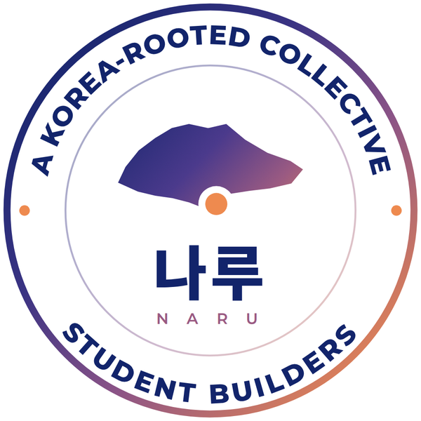
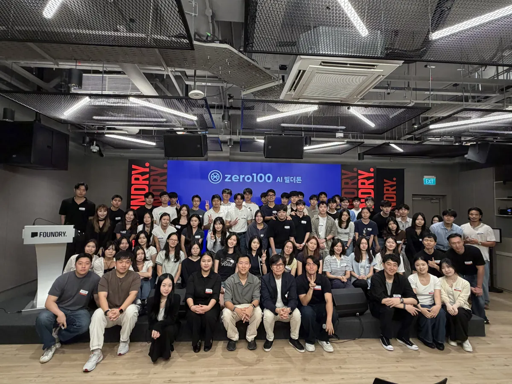
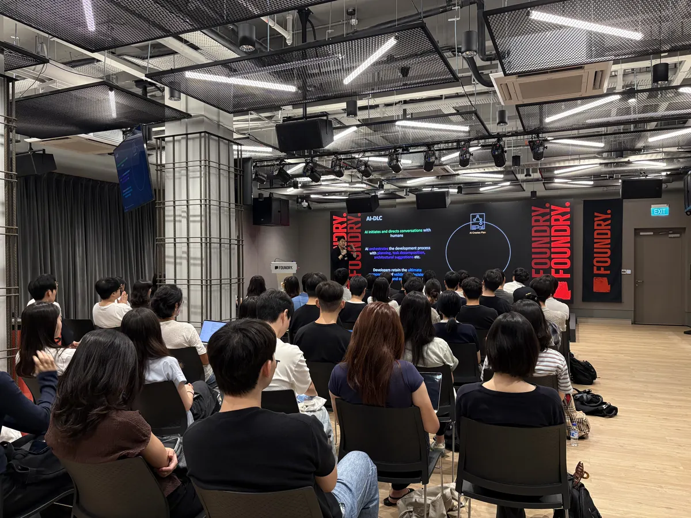
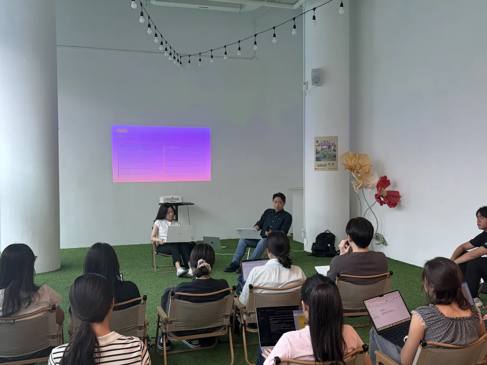
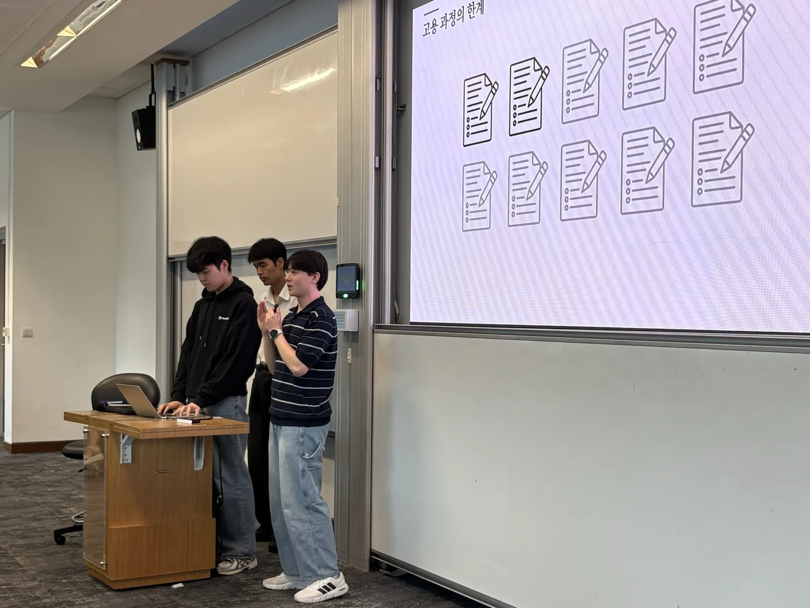
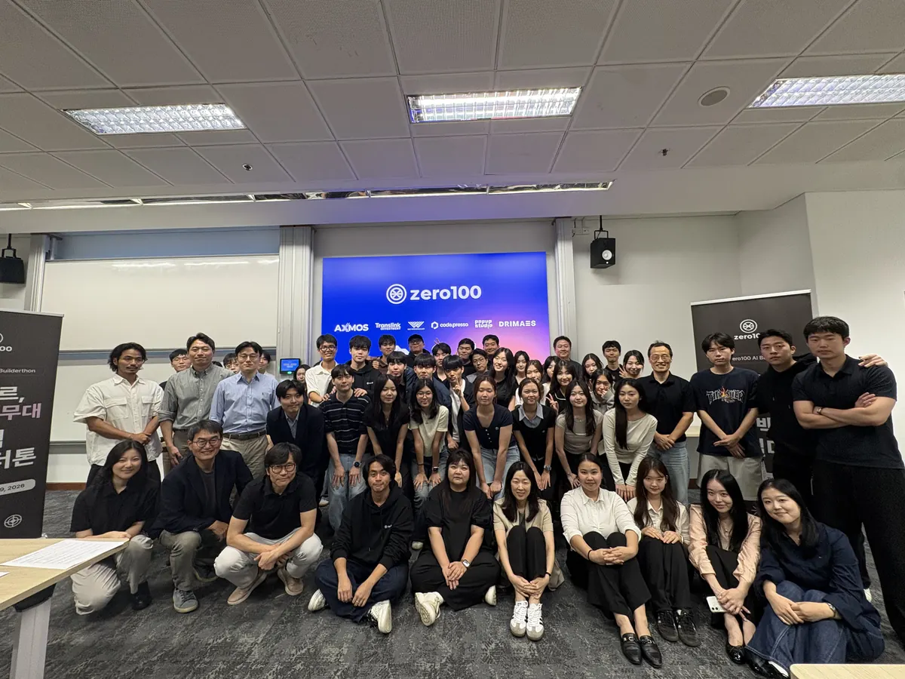

<p align="center">
  <picture>
    <source media="(prefers-color-scheme: dark)" srcset="public/naru/naru-master-v3-rev.png">
    
  </picture>
</p>

# 나루 NARU 웹사이트

**나루**는 한국에 뿌리를 두고 학생이 직접 운영하는, 영리를 목적으로 하지 않는 학생 빌더 그룹입니다(A Korea-rooted collective of student builders). 이 레포는 나루의 공식 사이트이고, 지금 홈은 2026년 12월 서울에서 여는 **크로싱 서울 CROSSING SEOUL**을 알립니다.

> 건너는 건 각자가 한다. 자리는 우리가 만든다.

<p align="center">
  
</p>
<p align="center"><sub>제로백 빌더톤 Day 1, 2026년 8월 22일 싱가포르</sub></p>

- 사이트: https://naru-crossing-seoul.vercel.app
- 한국어와 영어 두 벌(KR/EN 전환)

*NARU is a Korea-rooted, student-run, not-for-profit group of student builders. This repo is its website. The home page introduces CROSSING SEOUL (18 to 22 December 2026, Seoul), and `/2026-08` keeps the record of the group's first event, the Zero100 builderthon in Singapore.*

## 나루는

나루는 강을 건너려는 사람이 배를 타는 자리입니다. 건너는 일은 각자가 합니다. 나루는 건널 수 있는 자리를 만들고, 건너간 사람이 다시 돌아와 서는 자리도 같은 나루입니다.

시작은 싱가포르였습니다. 학교마다 한인 학생이 있는데 학교를 가로질러 잇는 자리가 없었고, 선배가 후배에게 남기고 가는 것도 없었습니다. 경쟁이 치열할수록 학점, 인턴, 졸업, 오퍼처럼 눈앞의 칸부터 채우게 되고, 나는 어디로 나아갈 수 있는지를 물을 시간은 없습니다. 문을 두드리는 법은 대개 절박해진 다음에 배웁니다. 나루는 그 자리를 앞당겨 만듭니다. 절박하지 않아도 시작할 수 있도록.

무엇이 바뀌어도 바뀌지 않는 것은 둘입니다.

1. **안전하게 도전할 수 있는 자리.** 스크리닝이 없고 순위가 없습니다. 못해도 되는 자리입니다. 잘하지 못한 것은 어디에도 기록되지 않고, 끝까지 해본 것은 남습니다.
2. **자기 가치를 증명해 보는 경험.** 실명이 박힌 기업, 실제로 그 일을 하는 사람, 답이 정해지지 않은 문제 앞에 섭니다.

이벤트는 이 둘을 실행하는 지금의 방식입니다. 어젠다와 형식은 바뀝니다.

나루를 만드는 주체는 언제나 학생입니다. 먼저 겪은 선배가 후배가 설 판을 깔고, 그 자리에서 자란 사람이 다음 회차를 엽니다. 일하는 구조는 세 층입니다.

| 층 | 누구 | 내는 것 |
| --- | --- | --- |
| 주최 | 나루 | 회차의 기획과 실행, 기록, 회차 사이의 연속성 |
| 주관 | 각 학교 한인 학생회 | 소속 학생, 공간, 학교 안의 명의 |
| 후원 | 참여 기업 | 문제와 자료, 자금, 멘토 |

학생회와 기업은 나루에서 직접 만나고, 진심으로 교류합니다. 나루는 회비를 받지 않고 가입 폼도 두지 않습니다. 참가자가 들어오는 길은 회차 하나입니다.

전문은 [매니페스토](public/naru/naru-manifesto-v3-2026-09.pdf)에 있습니다.

## 8월, 제로백 빌더톤

나루의 첫 이벤트입니다. 2026년 8월 22일부터 29일까지, 싱가포르에서 8일이었습니다.

스크리닝 없이 실제 기업의 문제를 받아 8일 동안 풀었고, 마지막 날 그 기업 앞에서 발표했습니다.

<p align="center">
  
  
  
</p>
<p align="center"><sub>Day 1 쉰아홉 명으로 시작했습니다. Day 5 세션. Day 8 앞에서 증명했습니다.</sub></p>

| | |
| --- | --- |
| 74명 | 신청 |
| 59명 | Day 1 참석 |
| 25팀 | 시작 |
| 21팀 | 마지막 날 발표 |
| 9팀 | 출제사에 직접 자료를 요청. 시키지 않았습니다 |

순위는 매기지 않았고 부문별로 시상했습니다. 행사가 끝난 뒤 CNA와 The Straits Times에 실렸습니다.

문제를 낸 기업, 개인 자격으로 저녁 시간을 낸 멘토들, 무대에 선 연사와 전문가, 멘토링을 위해 회관을 내어준 싱가포르 한인회, 각 학교 한인 학생회 운영진, 그리고 8일을 건너 마지막 날 앞에 선 21팀이 지금의 나루를 만들었습니다. 제로백 빌더톤이 없었으면 나루도, 크로싱 서울도 없습니다.

<p align="center">
  
</p>
<p align="center"><sub>Day 8, 시상식이 끝난 뒤</sub></p>

기록 전체는 [/2026-08](https://naru-crossing-seoul.vercel.app/2026-08)에 있습니다.

## 8월에서 12월로

8월의 두 장면(스크리닝 없이 진짜 문제를 받은 것, 마지막 날 그 기업 앞에 선 것)이 나루의 변하지 않는 두 개가 됐습니다. 크로싱 서울은 그 둘을 그대로 잇는 나루의 두 번째 이벤트입니다. 한 번으로는 사례가 되지 않고, 두 번째부터 선례가 됩니다.

8월을 치르고 남은 아쉬움 다섯과 12월의 답입니다.

| 8월 | 12월 |
| --- | --- |
| 출제사가 문제 접근법까지 정리해서 줬고, 팀마다 만든 것이 비슷했습니다 | 만들어야 하는 것과 그것이 어디에 적용되는지까지 학생이 정의합니다 |
| 멘토링 슬롯은 넉넉했는데 한 번도 쓰지 않은 팀이 있었습니다 | 멘토링의 디테일을 사전에 더 많이 공유합니다 |
| 팀 안에서는 붙었지만 팀과 팀은 섞이지 않았습니다 | 모든 활동을 대면으로 합니다. 다른 팀이 만드는 것을 현장에서 직접 봅니다 |
| 주관 학생이 함께 자랄 자리가 없었습니다 | 주관 학생도 피칭할 수 있습니다. 시상 대상은 아닙니다 |
| 끝난 뒤 멘토에게 먼저 연락한 팀은 한 팀이었습니다 | 끝난 뒤 멘토에게 먼저 연락하는 법까지 안내합니다 |

넓어지는 것은 둘입니다.

- **판.** 8월은 싱가포르 안에서 열렸습니다. 12월은 한국의 대학생, 해외에서 공부하는 한인 학생, 8월을 싱가포르에서 건넌 사람들이 같은 문제 앞에 섭니다. 팀은 1일차 현장에서 맺습니다.
- **AI를 쓰는 범위.** AI가 잘하는 일 셋 가운데 8월은 아이디어를 코드로 만드는 것 하나에 집중했습니다. 12월은 많은 데이터를 분석하는 것, 복잡한 프로세스를 이해하는 것을 더합니다. 그래서 데이터에서 시작합니다.

## 12월, 크로싱 서울

2026년 12월 18일(금)부터 22일(화)까지, 서울. 기업이 연 데이터에서 문제를 찾고, 마지막 날 그 기업 앞에서 발표하는 닷새입니다.

| 날 | 스테이지 |
| --- | --- |
| Day 0 | Context Open |
| Day 1 | Discovery |
| Day 2 | Build |
| Day 3 | Refine |
| Day 4 | Pitch |

- 스크리닝이 없습니다. 오는 사람이 참가자입니다. 팀은 2~3명입니다.
- 1위, 2위, 3위에 의미를 두지 않습니다. 각자의 강점이 과정에서 드러나고, 다양한 테마로 시상합니다.
- 멘토링은 Day 1부터 Day 3까지, 예약제입니다.
- 세부는 기획 단계라 바뀔 수 있습니다. 등록은 아직 열리지 않았고, 열리면 사이트에서 알립니다.

크로싱 서울을 제로백 빌더톤의 2회차라고 부르지 않습니다. 이름이 다른 이벤트이고, 물려받은 것은 코어 둘입니다.

## 그 이후

- **크로싱은 이어지는 이름입니다.** 크로싱이 이벤트의 이름이고 뒤의 도시가 회차를 구분합니다. 다음이 어디서 열리든 크로싱 [도시]가 됩니다. 다음 도시와 시기는 아직 정해지지 않았습니다.
- **형식은 바뀌어도 됩니다.** 8일이 닷새가 됐듯이, 어젠다도 형식도 그때 학생이 배워야 할 것을 따라갑니다. 새 방식을 고를 때 묻는 것은 둘입니다. 안전하게 도전할 자리를 넓히는가, 자기 가치를 증명할 기회를 주는가.
- **이벤트에서 커뮤니티로.** 이벤트로 학생을 모으고, 모인 사람들을 커뮤니티로 잇고, 각 나라의 학생회, 학회와 함께 서울과 싱가포르를 넘어 더 넓게 다가갑니다.
- **사람이 바뀌어도 남게.** 한 사람에게 주어진 시간은 길어야 1년입니다. 그래서 처음부터 승계를 전제로 설계합니다. 받은 사람이 다음 회차에 돌려주러 오는 자리를 남겨 둡니다.
- **남기는 것은 사람의 이야기입니다.** 결과물은 그 자리에서 소비되고 대부분 잊힙니다. 회차마다 거기서 나온 사람의 이야기를 기록합니다.

---

아래는 이 레포에 대한 안내입니다.

## 무엇이 있나

| 주소 | 내용 |
| --- | --- |
| `/` | 나루 홈. 크로싱 서울 소개, 프로그램, 얻는 것, 나루(8월의 기록, 세 층 구조), 왜 나루인가 |
| `/2026-08` | 제로백 빌더톤(2026년 8월, 싱가포르)의 기록. 나루의 첫 이벤트이고 끝난 회차입니다 |
| `/quiz` | 8월 팀 매칭에 쓴 유형 테스트 |
| `/api/crossing/register` | 크로싱 서울 등록 |
| `/api/register`, `/api/vote` | 8월 회차의 등록과 Day 8 투표 |

등록 창은 아직 열지 않았습니다(`lib/registrationWindow.ts`의 `CROSSING_WINDOW`가 둘 다 `null`). 값을 채우면 홈의 등록 버튼이 켜집니다. 12월과 8월의 용어 규칙은 `data/naru.ts` 맨 위 주석에 있습니다.

## 기술

- **Next.js 14**(App Router), **TypeScript**, **Tailwind CSS**
- **Framer Motion**: 스크롤 리빌, 모달
- **three.js**: 홈 배경(밤의 강과 등불, 서울과 싱가포르 윤곽). `lib/background/`
- **Supabase**: 등록과 투표 저장. 서버 라우트에서만 service role 키로 씁니다
- **Cloudflare Turnstile**: 12월 등록 폼의 봇 확인
- **Vercel**: 배포, Analytics, Speed Insights

## 로컬에서 돌리기

Node 18.17 이상이 필요합니다.

```bash
npm install
cp .env.local.example .env.local   # 값은 아래 표 참고
npm run dev                        # http://localhost:3999
```

```bash
npm run build   # 먼저 scripts/check-changelog.mjs가 돕니다
npm run start   # http://localhost:3999
```

dev 서버가 도는 동안 같은 폴더에서 `npm run build`를 돌리지 마세요. `.next`를 같이 써서 dev가 깨집니다.

### 환경 변수

| 이름 | 쓰는 곳 |
| --- | --- |
| `NEXT_PUBLIC_SUPABASE_URL` | Supabase 프로젝트 주소 |
| `SUPABASE_SERVICE_ROLE_KEY` | 서버 전용. `lib/supabaseAdmin.ts`만 읽습니다. `NEXT_PUBLIC_`를 붙이지 마세요 |
| `NEXT_PUBLIC_TURNSTILE_SITE_KEY` | Turnstile 사이트 키(공개 값) |
| `TURNSTILE_SECRET_KEY` | 서버 전용. 없으면 개발에서는 확인을 건너뛰고 운영에서는 503을 돌려줍니다 |

키가 없어도 화면은 뜹니다. 등록과 투표 API만 동작하지 않습니다. 표 구조는 `supabase/migrations/`에 있습니다.

## 어디를 고치나

카피와 화면을 나눠 둡니다. 화면에 보이는 문장은 전부 `{ ko, en }` 쌍이고, 컴포넌트는 `useLocale()`의 `t()`로 읽습니다.

| 바꾸려는 것 | 파일 |
| --- | --- |
| 홈(`/`)의 모든 문장 | `data/naru.ts` |
| 크로싱 서울의 이름과 날짜 | `lib/naruDates.ts` (단일 출처. 다른 곳에 날짜를 적지 않습니다) |
| 등록 창이 열리고 닫히는 시각 | `lib/registrationWindow.ts` |
| 12월 등록 폼의 문항 | `data/crossingForm.ts` |
| 홈의 배치와 챕터 | `components/home/NaruHome.tsx` |
| 헤더와 목차 | `components/journey/JourneyNav.tsx`, `data/naru.ts`의 `naruNav` |
| 배경 | `lib/background/` (`config.ts`가 수치) |
| 8월 기록(`/2026-08`)의 문장과 일정 | `data/dictionary.ts`, `data/schedule.ts` |
| 나루 로고 | `public/naru/` (같은 폴더 README에 출처와 규칙) |
| README의 로고와 사진 | `docs/readme/`(밝은 화면용 로고), `public/naru/`(어두운 화면용), `public/record/`(8월 사진) |
| 색과 서체 | `tailwind.config.ts`, `app/globals.css` |
| 사이트 주소와 메타데이터 | `app/layout.tsx`, `app/sitemap.ts`, `app/robots.ts` |

`data/naru.ts`와 `data/dictionary.ts`는 섞지 않습니다. 앞은 나루 그룹의 정본이고 뒤는 8월 회차의 정본입니다.

## 일하는 규칙

전문은 `CLAUDE.md`에 있습니다.

- 체인지로그는 레포 루트의 `CHANGELOG.md` 하나입니다. 새 항목은 맨 위에 씁니다. 다른 체인지로그 파일이 있으면 빌드가 실패합니다.
- 결정은 코드 주석에 `DECIDED YYYY-MM-DD`로 남깁니다. 아직 확정되지 않은 것은 지어내지 않고 `TODO: confirm`으로 표시합니다.
- em dash 문자를 쓰지 않습니다.
- 큰 변경은 `docs/`에 브리프를 두고, 브리프의 검증을 마친 뒤에 푸시합니다.
- 사람 이름, 연락처, 참가자 개인 정보를 체인지로그와 문서에 쓰지 않습니다.

## 배포

`main`에 푸시하면 Vercel이 프로덕션으로 배포합니다. 그래서 검증을 마친 뒤에 푸시합니다.

## 구조

```
app/
  page.tsx               나루 홈
  2026-08/               제로백 빌더톤 기록
  quiz/                  유형 테스트
  api/                   등록, 투표 라우트
  layout.tsx             메타데이터, 서체, 로케일
components/
  home/                  홈(NaruHome, RecordTabs)
  crossing/              12월 등록 모달과 Turnstile
  journey/               헤더, 챕터, 8월 페이지
  shared/, ui/           같이 쓰는 조각
data/                    카피 정본(naru, dictionary, schedule, crossingForm, quiz)
lib/
  background/            three.js 배경
  naruDates.ts           12월 이름과 날짜
  registrationWindow.ts  등록 창
  supabaseAdmin.ts       서버 전용 Supabase 클라이언트
docs/                    브리프와 감사 기록
scripts/                 빌드 전 검사, 배경 형상 굽기, 로고 처리
supabase/migrations/     표 정의
public/                  로고, 사진, 서체
```
